# 🚀 Fullstack Web Development Journey

<div align="center">


[](https://dibimbing.id)
[]()
[]()

### *Where theory meets practice, and code becomes capability.*

</div>

---

## 🎯 About This Repository

> **This isn't just coursework it's a living proof of my transformation into a fullstack developer.**

Welcome to my comprehensive learning portfolio through [**dibimbing.id's**](https://dibimbing.id) intensive professional training program. Every file here represents a problem solved, a concept mastered, and a skill sharpened through deliberate practice.

### 💡 What You'll Find Here

```diff
+ Progressive mastery from fundamentals to advanced concepts
+ Real solutions to industry-relevant challenges
+ Production-ready, tested, and well-documented code
+ Continuous evolution through refactoring and optimization
```

---

## 🛠️ Technical Arsenal

<div align="center">

### The Complete Modern Web Development Stack

</div>

<table>
<tr>
<td width="50%" valign="top">

### 🎨 Frontend Mastery

#### **Core Web Technologies**

<details open>
<summary><b>📝 HTML5 - Semantic & Accessible</b></summary>

```html
<semantic_structure>
  ✓ Modern HTML5 elements
  ✓ Accessibility (ARIA, semantic tags)
  ✓ SEO-optimized markup
  ✓ Forms and validation
</semantic_structure>
```
</details>

<details open>
<summary><b>🎨 CSS3 - Responsive Design</b></summary>

```css
.modern_css_expertise {
  fundamentals: "Box model, positioning, flexbox, grid";
  responsive: "Mobile-first, media queries";
  advanced: "Animations, transitions, transforms";
  mastery: "Complex layouts, visual effects";
}
```
</details>

<details open>
<summary><b>⚡ Tailwind CSS - Utility-First Framework</b></summary>

```css
/* Rapid UI Development */
@tailwind {
  ✓ Core utilities & responsive modifiers
  ✓ Layout systems (flexbox, grid)
  ✓ Typography & visual hierarchy
  ✓ Dynamic interfaces & interactions
}
```
</details>

</td>
<td width="50%" valign="top">

### ⚡ JavaScript Ecosystem

<details open>
<summary><b>🔧 JavaScript Fundamentals</b></summary>

```javascript
const fundamentals = {
  basics: [
    'Variables & data types',
    'Control flow & loops',
    'Functions & scope',
    'Arrays & objects'
  ],
  essential: true
};
```
</details>

<details open>
<summary><b>🚀 Modern JavaScript (ES6+)</b></summary>

```javascript
const modernJS = {
  features: [
    'Arrow functions & destructuring',
    'Template literals',
    'Array methods (map, filter, reduce)',
    'Spread/rest operators',
    'Classes & inheritance'
  ],
  level: 'Advanced'
};
```
</details>

<details open>
<summary><b>🧠 Advanced Concepts</b></summary>

```javascript
async function masterJS() {
  const skills = {
    async: ['Promises', 'Async/Await'],
    dom: ['Manipulation', 'Events'],
    oop: ['Classes', 'Encapsulation'],
    functional: ['Higher-order functions']
  };
  return skills;
}
```
</details>

</td>
</tr>
</table>

---

### ⚛️ React Development - Building Modern Applications

<div align="center">


</div>

<table>
<tr>
<td width="33%" valign="top">

#### 🏗️ **Fundamentals**

```jsx
const ReactCore = () => {
  const skills = [
    'JSX syntax',
    'Components',
    'Props & State',
    'Event handling'
  ];
  
  return <Mastery level="solid" />;
}
```

</td>
<td width="33%" valign="top">

#### 🪝 **Hooks Ecosystem**

```jsx
function HooksExpert() {
  const [state, setState] = useState();
  useEffect(() => {
    // Side effects
  });
  
  // useContext, useReducer
  // Custom hooks
  
  return <Advanced />;
}
```

</td>
<td width="33%" valign="top">

#### 🚦 **Routing & APIs**

```jsx
const FullStack = {
  routing: 'React Router',
  api: 'RESTful integration',
  crud: 'Complete operations',
  deploy: 'Production ready'
};
```

</td>
</tr>
</table>

<details>
<summary><b>📦 Click to expand: Complete React Skills Breakdown</b></summary>

<br>

```javascript
const reactExpertise = {
  fundamentals: {
    components: 'Functional & Class components',
    jsx: 'JSX syntax and composition',
    props: 'Props passing and validation',
    state: 'State management patterns',
    events: 'Event handling in React'
  },
  
  hooksEcosystem: {
    useState: 'Component state management',
    useEffect: 'Side effects & lifecycle',
    useContext: 'Global state sharing',
    useReducer: 'Complex state logic',
    customHooks: 'Reusable logic patterns'
  },
  
  advancedPatterns: {
    contextAPI: 'Application-wide state',
    composition: 'Component composition',
    optimization: 'Performance tuning',
    patterns: 'Design patterns in React'
  },
  
  styling: {
    approaches: 'Multiple styling methods',
    tailwind: 'Tailwind CSS integration',
    responsive: 'Mobile-first components',
    themes: 'Theming strategies'
  },
  
  routing: {
    reactRouter: 'Route configuration',
    dynamic: 'Dynamic route parameters',
    protected: 'Protected routes',
    navigation: 'Programmatic navigation'
  },
  
  apiIntegration: {
    restful: 'RESTful API consumption',
    crud: 'Create, Read, Update, Delete',
    http: 'Axios/Fetch for HTTP requests',
    async: 'Async data patterns',
    errors: 'Error handling & loading states'
  },
  
  deployment: {
    build: 'Production optimization',
    hosting: 'Deployment platforms',
    env: 'Environment configuration',
    performance: 'Bundle optimization'
  }
};
```

</details>

---

### 🔍 Algorithms & Problem Solving

<div align="center">


</div>

<table>
<tr>
<td width="50%">

#### 🔎 **Searching Algorithms**

```python
def search_mastery():
    algorithms = {
        'linear_search': 'Sequential scanning',
        'binary_search': 'Divide and conquer',
        'optimization': 'Time complexity O(log n)'
    }
    return algorithms
```

</td>
<td width="50%">

#### 📊 **Sorting Algorithms**

```python
sorting_expertise = [
    'Bubble Sort - O(n²)',
    'Selection Sort - O(n²)',
    'Merge Sort - O(n log n)',
    'Quick Sort - O(n log n)',
    'Algorithm analysis & optimization'
]
```

</td>
</tr>
</table>

---

### 🔧 Professional Development Tools

<div align="center">

#### Version Control & Collaboration

</div>

```bash
# Git Mastery - Professional Workflow
$ git workflow --professional

✓ Repository management & branching strategies
✓ Meaningful commits & version history
✓ Collaborative development (pull requests, code reviews)
✓ Merge conflict resolution
✓ Git flow patterns (feature branches, releases)
```

<div align="center">

---

## 📚 Learning Curriculum Overview

<div align="center">

### Structured Path from Fundamentals to Mastery

```mermaid
graph LR
    A[Web Basics] --> B[JavaScript Core]
    B --> C[Advanced JS]
    C --> D[HTML & CSS]
    D --> E[Tailwind CSS]
    E --> F[React Fundamentals]
    F --> G[React Advanced]
    G --> H[Full Stack Integration]
    
    style A fill:#FFE5E5,stroke:#FF6B6B,stroke-width:3px,color:#000
    style B fill:#FFF4E5,stroke:#FFA94D,stroke-width:3px,color:#000
    style C fill:#FFF9DB,stroke:#FFD93D,stroke-width:3px,color:#000
    style D fill:#E3F2FD,stroke:#42A5F5,stroke-width:3px,color:#000
    style E fill:#E8F5E9,stroke:#66BB6A,stroke-width:3px,color:#000
    style F fill:#F3E5F5,stroke:#AB47BC,stroke-width:3px,color:#000
    style G fill:#E0F2F1,stroke:#26A69A,stroke-width:3px,color:#000
    style H fill:#C8E6C9,stroke:#43A047,stroke-width:3px,color:#000
```

</div>



<details>
<summary><b>🌐 Module 1: Introduction to Web Development</b></summary>

- Web architecture & client-server model
- Development environment setup
- Industry overview & career paths
- Professional workflow fundamentals

</details>

<details>
<summary><b>🧩 Module 2: Problem-Solving Essentials</b></summary>

- Computational thinking
- Algorithm design principles
- Debugging techniques
- Code optimization strategies

</details>

<details>
<summary><b>⚡ Module 3: JavaScript Mastery</b></summary>

**Part 1: Fundamentals**
- Variables, data types, operators
- Control flow and loops
- Functions and scope
- Arrays and objects

**Part 2: Modern JavaScript**
- ES6+ features
- Array methods (map, filter, reduce)
- Object-oriented programming
- Template literals

**Part 3: Advanced Concepts**
- Asynchronous JavaScript
- DOM manipulation
- Web APIs
- Functional programming

**Part 4: Algorithms**
- Searching algorithms
- Sorting algorithms
- Algorithm optimization

**Part 5: Tools & Libraries**
- Lodash utilities
- Development best practices

</details>

<details>
<summary><b>🎨 Module 4: HTML & CSS Excellence</b></summary>

**HTML5**
- Semantic markup
- Accessibility standards
- Forms and validation
- SEO optimization

**CSS3**
- Layout systems (Flexbox, Grid)
- Responsive design
- Animations and transitions
- Modern CSS features

**Tailwind CSS**
- Utility-first methodology
- Rapid prototyping
- Component styling
- Production optimization

</details>

<details>
<summary><b>⚛️ Module 5: React Development</b></summary>

**Fundamentals**
- Component architecture
- JSX and composition
- Props and state
- Event handling

**Hooks**
- useState, useEffect
- useContext, useReducer
- Custom hooks

**Advanced**
- Context API
- Performance optimization
- Component patterns

**Styling**
- Component styling approaches
- Tailwind integration

**Routing**
- React Router
- Dynamic routing
- Protected routes

**API Integration**
- RESTful APIs
- CRUD operations
- Async patterns

**Deployment**
- Production builds
- Optimization strategies

</details>

<details>
<summary><b>🔧 Module 6: Version Control System</b></summary>

- Git fundamentals
- Repository management
- Branching strategies
- Collaboration workflow
- Best practices

</details>

<details>
<summary><b>💼 Module 7: Portfolio & Professional Skills</b></summary>

- Portfolio development
- Business requirements
- Professional communication
- Career preparation

</details>

---

## 🎯 My Development Philosophy

<div align="center">

> ### *"Code is read more often than it's written."*
> Building with intention, documenting with clarity, learning with purpose.

</div>
